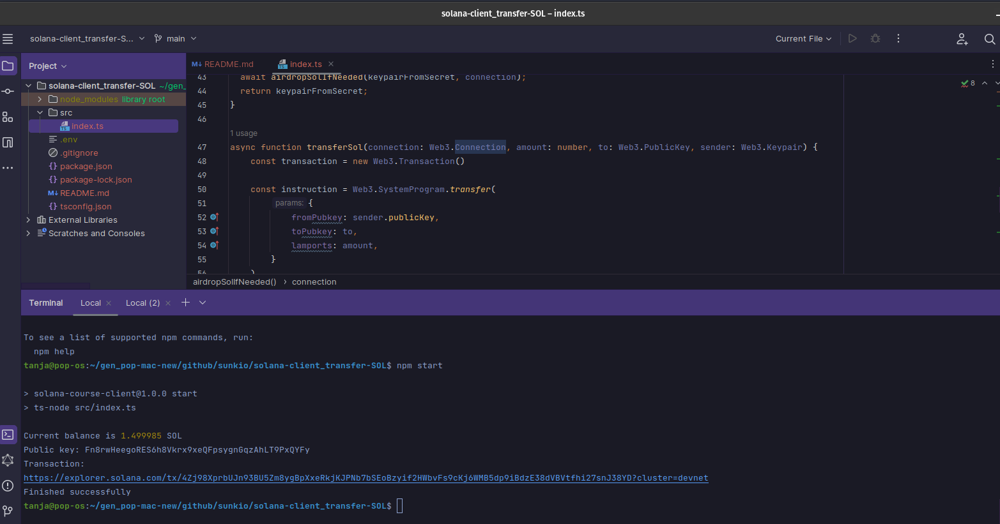
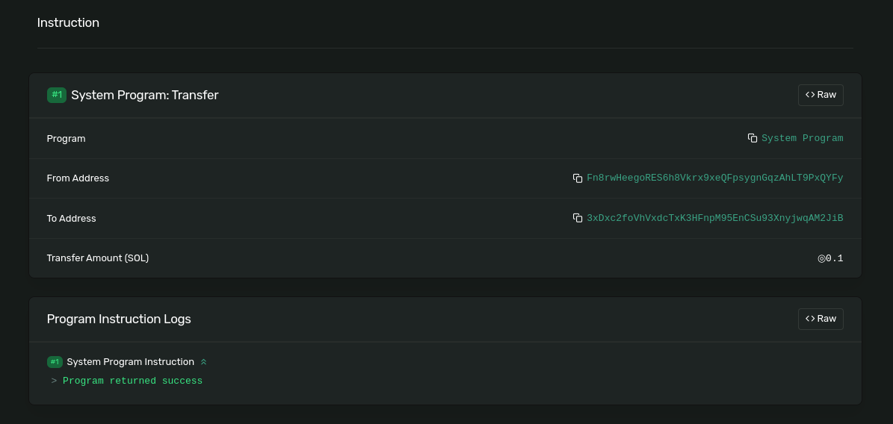

# Solana Client: Transfer SOL

This repository contains a simple Solana client that transfers SOL tokens between two accounts on the Solana devnet. It is built using the Solana JavaScript API and is designed for educational purposes.
This Solana client was built as part of the 6-week [Solana Core Developer Program](https://buildspace.so/p/solana-core/) on [buildspace](https://buildspace.so).


*Solana Client CLI Output*


*Solana Explorer - Result of Token Transfer*

## Table of Contents
- [Features](#features)
- [Getting Started](#getting-started)
- [Prerequisites](#prerequisites)
- [Installation](#installation)
- [Usage](#usage)
- [Understanding the Code](#understanding-the-code)
- [Resources](#resources)
- [Contributing](#contributing)
- [License](#license)
- [Support](#support)


## Features
- Connect to a Solana cluster (Devnet in this case)
- Generate a new keypair if not provided
- Airdrop SOL tokens to the account if the balance is less than 1 SOL
- Transfer SOL tokens to another account

## Getting Started
Follow these steps to set up the project locally.

### Prerequisites
Before getting started, make sure you have the following software installed on your system:

- [Node.js](https://nodejs.org/en/) (version 14.x or later)

This project was built using Node.js v18.14.0. If you use [NVM](https://github.com/nvm-sh/nvm), you can run `nvm use` to switch to this version.

### Installation
1. [Fork](https://docs.github.com/en/get-started/quickstart/fork-a-repo) and then clone this repository:
   ```
   git clone https://github.com/<your username>/solana-client_transfer-SOL.git
   ```
2. Change to the project directory:
   ```
   cd solana-client_transfer-SOL
   ```
3. Install the dependencies:
   ```
   npm ci 
   ```

## Usage
1. Start the script:
   ```
   npm start
   ```
2. The script will generate a new keypair if not provided and airdrop 1 SOL token to the account if the balance is less than 1 SOL.
3. The script will transfer 0.1 SOL to a randomly generated account and display the transaction link.

## Understanding the Code
- The `initializeKeypair()` function generates a new keypair if not provided and requests an airdrop if the account balance is less than 1 SOL.
- The `transferSol()` function transfers the specified amount of SOL tokens to the given account.
- The `main()` function initializes the connection to Solana devnet, sets up the keypair, and transfers 0.1 SOL to a randomly generated account.

## Resources
- [Solana Web3.js Documentation](https://solana-labs.github.io/solana-web3.js/)
- [Solana Developer Guide](https://docs.solana.com/developing)
- [Solana Explorer](https://explorer.solana.com/)
- [Solana Core Developer Program](https://buildspace.so/p/solana-core/) at [buildspace](https://buildspace.so)

## Contributing
Contributions are always welcome! If you'd like to contribute to this project or have any suggestions, feel free to create a new issue or submit a pull request. Please check the [Code of Conduct](./CODE_OF_CONDUCT.md) first.

To submit a pull request, follow these steps:
1. Fork the repository
2. Create your feature branch (`git checkout -b feature/your-feature-name`)
3. Commit your changes (`git commit -am 'Add some feature'`)
4. Push to the branch (`git push origin feature/your-feature-name`)
5. Create a new Pull Request

## License

This project is open-source and available under the [MIT License](./LICENSE.md).

## Support
If you have any questions or need help getting started, please open an issue in the repository or contact me on Twitter: @tanja_codes